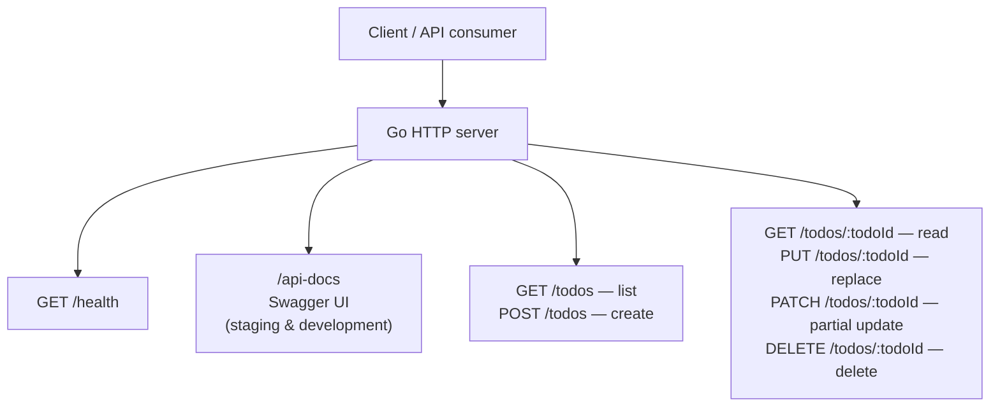

# Todo List Application

A todo list application repository used for demos and integration work.

## Overview

This project hosts the todo list application source and related artifacts (including API specifications where applicable).

## API flow

High-level request routing for the Todo REST service defined in [`api-spec.yaml`](api-spec.yaml). By default the server runs in **staging** mode on port **8000**. In staging or development, interactive docs are served from `/api-docs`.



## Prerequisites

- **Go** 1.22 or newer
- **Git**

## Getting started

1. Clone the repository:

   ```bash
   git clone https://github.com/QCI-Demo-Stage/todo-list-application.git
   cd todo-list-application
   ```

2. Run the API server (default port **8000**, default `NODE_ENV` **staging** so `/api-docs` is available):

   ```bash
   go run .
   ```

3. Optional: build a binary:

   ```bash
   go build -o todo-api .
   ./todo-api
   ```

4. Run tests:

   ```bash
   go test ./...
   ```

## Configuration

Do not commit secrets. Copy environment templates if provided and use a local `.env` file (ignored by Git).

## Contributing

Use feature branches and open pull requests against `main`. Keep commits focused and descriptions clear.

## License

See the repository license file when one is added.
